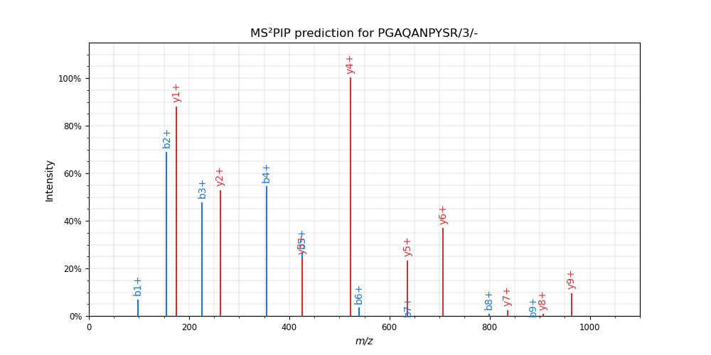

#####
Usage
#####

Quickstart
==========

[todo]

Usage modes
===========

MS²PIP has various usage modes that each can be accessed through the command-line interface, or
through the Python API.

``predict-single``
------------------

In this mode, a single peptide spectrum is predicted with MS²PIP and optionally plotted with
`spectrum_utils <https://spectrum-utils.readthedocs.io/>`_. For instance,

.. code-block:: sh

    ms2pip predict-single "PGAQANPYSR/3" --model TMT

results in:

``predict-batch``
-----------------

[todo]

``predict-library``
-------------------

[todo]

This mode was first developed in collaboration with the ProGenTomics group for the
`MS²PIP for DIA <https://github.com/brvpuyve/MS2PIP-for-DIA>`_ project.

``correlate``
-------------

[todo]

``get-training-data``
---------------------

[todo]

To train a new prediction model, see :ref:`Training new MS²PIP models`.

Input files
===========

PSM files
---------

To apply the pre-trained models you need to pass *only* a PSM file to
MS²PIP. This file contains the peptide sequences for which you want to predict
spectra.

[todo list accepted formats]

Peptides must be strictly longer than 2 and shorter than 100 amino acids and
cannot contain the following amino acid one-letter codes: B, J, O, U, X or Z.
Peptides not fulfilling these requirements will be filtered out and will not be
reported in the output.

Spectrum file
-------------

Optionally, an MGF or mzML file with measured spectra can be passed to MS²PIP. In this
case, MS²PIP will calculate correlations between the measured and predicted
peak intensities. Make sure that the PSM file `spectrum_id` matches the MGF `TITLE`
field or mzML `nativeID` fields. Spectra present in the spectrum file, but missing in the
PEPREC file (and vice versa) will be skipped.

Output
======

The predictions are saved in the output file(s) specified command. Note that the normalization of
intensities depends on the output file format. In the CSV file output, intensities are
log2-transformed. To "unlog" the intensities, use the following formula:
``intensity = (2 ** log2_intensity) - 0.001``.
