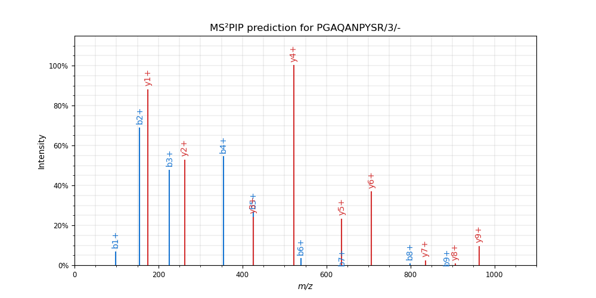

#####
Usage
#####

Usage modes
===========

MS²PIP has various usage modes that each can be accessed through the command-line interface, or
through the Python API.

``predict-single``
------------------

In this mode, a single peptide spectrum is predicted with MS²PIP and optionally plotted with
`spectrum_utils <https://spectrum-utils.readthedocs.io/>`_. For instance,

.. code-block:: sh

    ms2pip predict-single "PGAQANPYSR/3" --model TMT --plot

results in:

``predict-batch``
-----------------

Provide a list of peptidoforms (see :ref:`Peptides / PSMs`) to predict multiple spectra at once.
For instance,

.. code-block:: sh

    ms2pip predict-batch peptides.tsv --model TMT

results in a file ``peptides_predictions.csv`` with the predicted spectra.

``predict-library``
-------------------

Predict spectra for a full peptide search space generated from a protein FASTA file. Various
peptide search space parameters can be configured to control the peptidoforms that are generated.
See :py:mod:`ms2pip.search_space` for more information.

Minimal example:

.. code-block:: sh

    ms2pip predict-library proteins.fasta

This mode was first developed in collaboration with the ProGenTomics group for the
`MS²PIP for DIA <https://github.com/brvpuyve/MS2PIP-for-DIA>`_ project.

``correlate``
-------------

Predict spectrum intensities for a list of peptides and correlate them with observed intensities
from a spectrum file. This mode is useful for evaluating MS²PIP models or for (re)scoring
peptide-spectrum matches.

For instance:

.. code-block:: sh

    ms2pip correlate results.sage.tsv --spectrum-file spectra.mgf

``get-training-data``
---------------------

Given a list of peptides and corresponding spectra, generate training data for MS²PIP. This
includes observed intensities for the supported ion types and the feature vectors for each ion.
For more info, see :ref:`Training new MS²PIP models`.

``annotate-spectra``
---------------------

Given a list of peptides annotate the peaks in the corresponding spectra.

Input
=====

Peptides / PSMs
---------------

PSM file types
~~~~~~~~~~~~~~

For peptide information input, MS²PIP accepts any file format that is supported by
:py:mod:`psm_utils`. See
`Supported file formats <https://psm-utils.readthedocs.io/en/stable/#supported-file-formats>`_ for
the full list. The simplest format is a tab-separated file with at least the columns
``peptidoform`` and ``spectrum_id`` present.

- ``peptidoform`` is the full
  `ProForma 2.0 notation <https://doi.org/10.1021/acs.jproteome.1c00771>`_ including amino acid
  modifications and precursor charge state.
- ``spectrum_id`` should match the ``TITLE`` or ``nativeID`` field of the related spectrum in the
  optional MGF or mzML file, if provided. Otherwise, any value is accepted.

For example:

.. code-block::

    peptidoform	spectrum_id
    RNVIM[Oxidation]DKVAK/2	1
    KHLEQHPK/2	2
    ...

See :py:mod:`psm_utils.io.tsv` for the full specification.

Peptide sequence properties
~~~~~~~~~~~~~~~~~~~~~~~~~~~

Peptides must be strictly longer than 2 and shorter than 100 amino acids and
cannot contain the following amino acid one-letter codes: B, J, O, U, X or Z.
Peptides not fulfilling these requirements will be filtered out and will not be
reported in the output.

Amino acid modifications
~~~~~~~~~~~~~~~~~~~~~~~~

Amino acid modification labels must be resolvable to a known mass shift. This means that
accepted labels are:

- A name or accession from an controlled vocabulary, such as Unimod or PSI-MOD. (e.g.,
  ``Oxidation``, ``U:Oxidation``, ``U:35``, ``MOD:00046``...)
- An elemental formula (e.g, ``Formula:C12H20O2``)
- A mass shift in Da (e.g., ``+15.9949``)

Any unresolvable modification will result in an error. If needed, PSM files can be converted with
:py:mod:`psm_utils.io` and modifications can be renamed with the
:py:meth:`~psm_utils.psm_list.PSMList.rename_modifications()` method.

Spectrum file
-------------

In the :ref:`correlate` and :ref:`get-training-data` usage modes, an MGF or mzML file with observed
spectra must be provided to MS²PIP.

Make sure that the PSM file ``spectrum_id`` matches the MGF ``TITLE`` field or mzML ``nativeID``
fields. If the values of these fields are different, but the PSM file ``spectrum_id`` is embedded
in them, the ``spectrum_id_pattern`` argument can be used to extract the ``spectrum_id`` from
the ``TITLE`` or ``nativeID`` fields with a regular expression pattern. For example, if an MGF
entry has ``TITLE=scan=1``, but the PSM file has ``spectrum_id=1``, ``spectrum_id_pattern`` can be
set to ``scan=(\d+)``. Note that the pattern must contain a single matching group that captures the
``spectrum_id``.

.. note::
  Find out more about regular expression patterns and try them on
  `regex101.com <https://regex101.com/>`_. You can try out the above examples at
  https://regex101.com/r/TynuIe/1.

Spectra present in the spectrum file, but missing in the PSM file (and vice versa) will be skipped.

Output
======

MS²PIP supports various spectral library output formats, including TSV, MGF, MSP, Spectronaut CSV,
BiblioSpec/Skyline SSL and MS2, and Encycopedia DLIB.

Note that the normalization of intensities depends on the output file format. In the TSV file
output, intensities are log2-transformed. To "unlog" the intensities, use the following formula:

.. code-block::

    intensity = (2 ** log2_intensity) - 0.001
